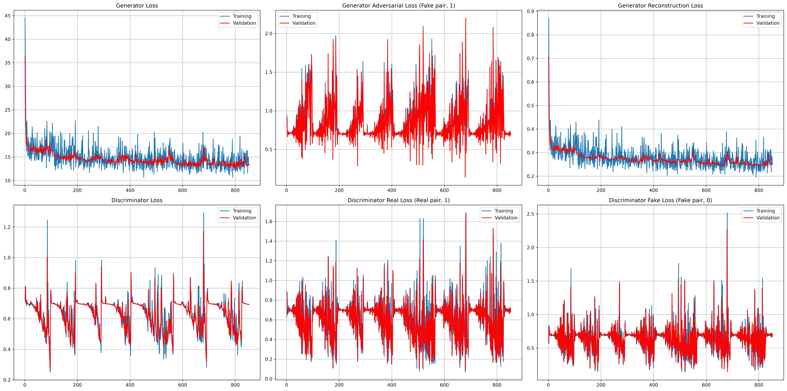
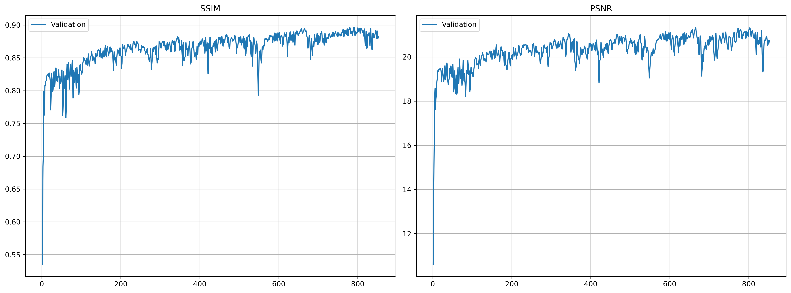
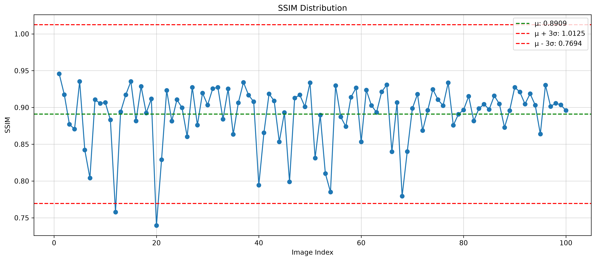
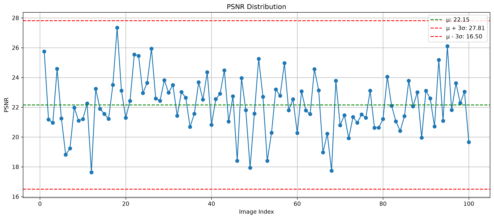
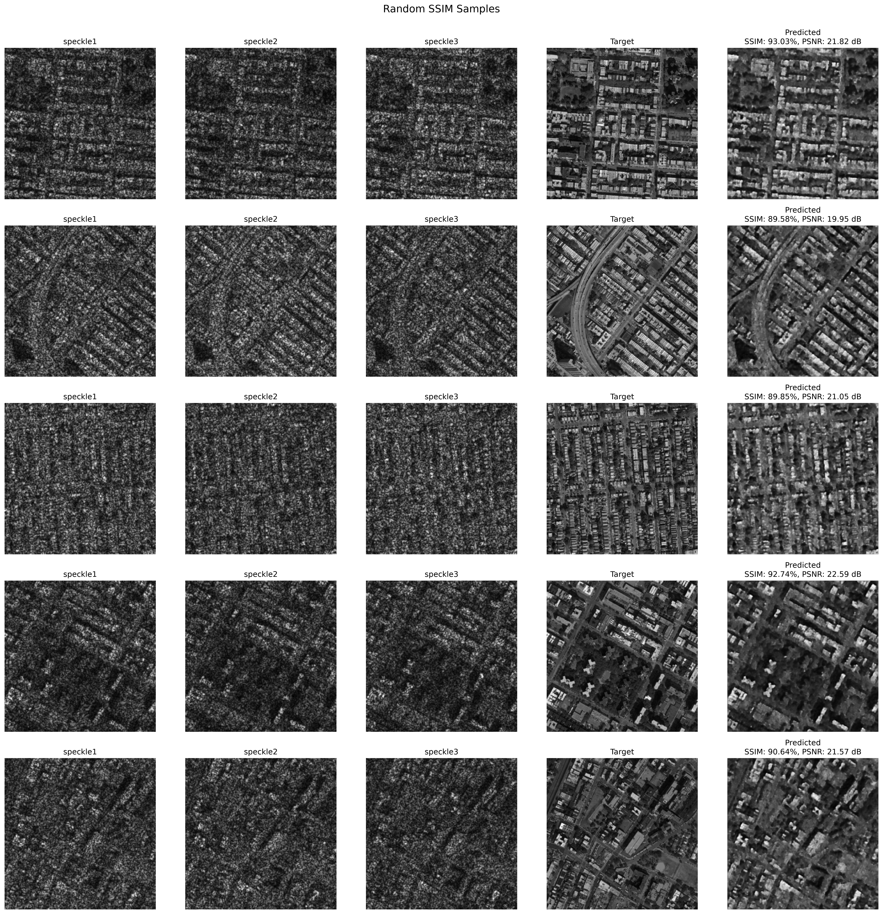
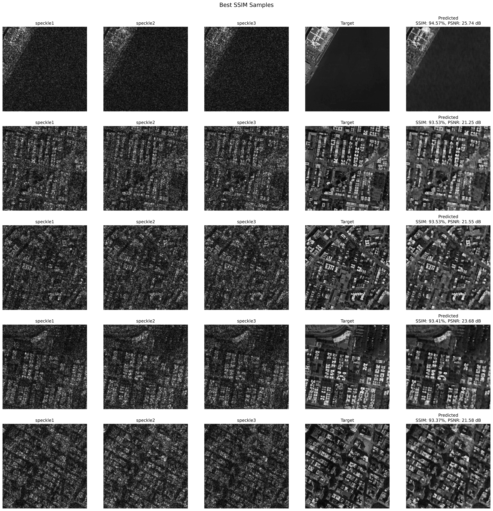
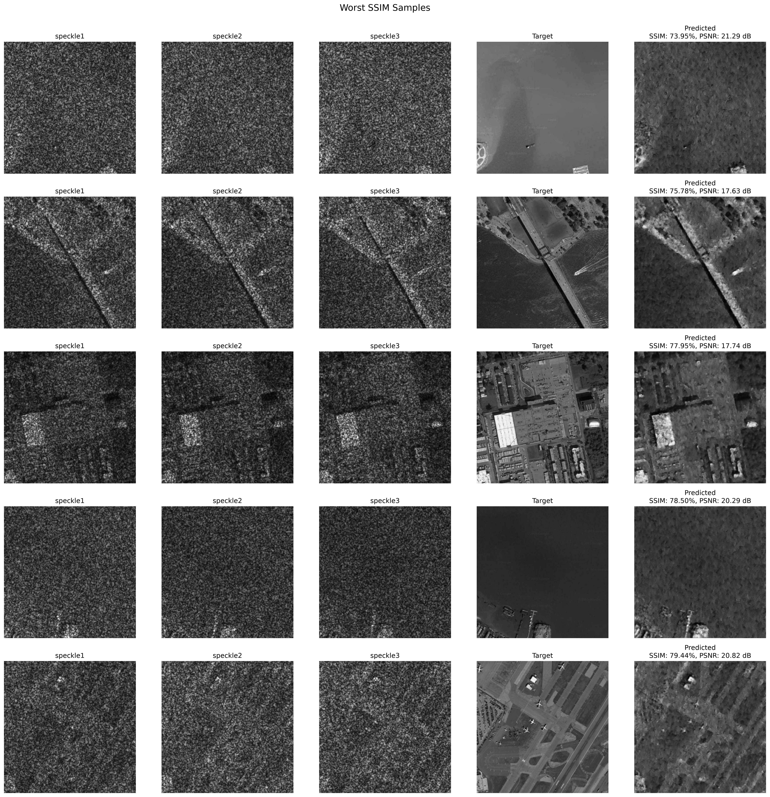

# Conditional-GAN-based Image Restoration from Speckle Interference Patterns

<p align="center">

**Debanjan Halder**  
*Department of Physics, Indian Institute of Technology Delhi*
Under the supervision of 
- Prof. Kedar Khare, Optics \& Photonics Centre, IIT Delhi
- Prof. Bodhaditya Santra, Department of Physics, IIT Delhi

</p>

---

A research-oriented implementation of **Pix2Pix conditional GANs for image restoration from speckle interference patterns**.

This project investigates the reconstruction of clean images from highly distorted optical measurements generated through a speckle-interference process. The final Pix2Pix model is trained **from scratch** and evaluated on a held-out test set.

> **Final Test SSIM:** 89.66%
> **Final Test PSNR:** 21.25 dB
> **Framework:** Pix2Pix / Conditional GAN

---

## 1. Problem

Speckle interference provides an indirect measurement of the underlying object. Although the original image information is encoded in the speckle pattern, recovering it requires learning a highly non-trivial inverse transformation:

$$
\boxed{\text{Speckle Pattern} \rightarrow \text{Clean Image}}
$$

The difficulty is amplified by a fundamental asymmetry in the GAN problem.

The **generator** must learn to infer image structure from a visually complex speckle measurement, suppress speckle-induced distortions, and reconstruct both global and local features.

The **discriminator**, in comparison, only needs to distinguish:

$$
\text{Real Image} \quad \text{vs.} \quad \text{Generated Image}
$$

This makes the discriminator's task substantially easier than the generator's inverse-imaging task. Consequently, the discriminator can become excessively strong while the generator is still learning the underlying mapping.

This imbalance became a central optimization challenge of the project.

---

## 2. Speckle Generation

The dataset is generated using a Fourier-domain optical model.

For each clean image, three independent speckle realizations are generated using independent random phase distributions.

The simulated process follows:

$$
A(x,y)=\frac{I(x,y)}{255}
$$

$$
g(x,y)=A(x,y)e^{i\phi(x,y)}
$$

where

$$
\phi(x,y)\sim U(-\pi,\pi)
$$

The complex field is propagated using a Gaussian impulse function $h(x, y)$ and detected as an intensity:

$$
I(x, y) = |g(x, y) \star h(x, y)|^2
$$

The resulting speckle measurements are normalized and transformed using a power-law gamma operation.

### Main simulation parameters

| Parameter            |                Value |
| -------------------- | -------------------: |
| Image resolution     |            256 × 256 |
| Speckle channels     |                    3 |
| PSF                  |             Gaussian |
| Gaussian σ           |                  1.0 |
| Random phase         |   Uniform \([-π,π]\) |
| Gamma transformation |                 0.39 |

The three independent speckle realizations are provided as the three input channels to the generator.

---

## 3. Pix2Pix Architecture

The restoration system follows the **Pix2Pix conditional GAN** formulation.

Given a speckle observation \(x\), the generator produces:

$$
\hat{y}=G(x)
$$

The discriminator evaluates the conditional pairs:

$$
D(x,y)
$$

and

$$
D(x,G(x))
$$

for real and generated images respectively.

### Generator

The generator is a **U-Net-based encoder-decoder** with skip connections.

Its main characteristics are:

* 3-channel speckle input
* 1-channel reconstructed image
* convolutional encoder-decoder
* Instance Normalization
* LeakyReLU encoder activations
* ReLU decoder activations
* U-Net skip connections
* Tanh output

The skip connections preserve spatial information while the deeper layers learn the nonlinear mapping from the speckle measurement to the underlying image.

### Discriminator

The discriminator is a **conditional PatchGAN-style discriminator**.

Its feature progression is:

```text
6 → 64 → 128 → 256 → 512 → 1
```

The six input channels consist of:

```text
3 speckle channels + 3 target/generated image channels
```

The discriminator therefore evaluates local consistency between the input speckle pattern and the corresponding image.

---

## 4. Training Objective

The generator combines adversarial and reconstruction losses:

$$
\mathcal{L}_G =
\mathcal{L}_{adv}
+
\lambda_{recon}\mathcal{L}_{recon}
$$

with:

$$
\lambda_{recon}=50
$$

The reconstruction loss combines L1 and SSIM:

$$
\mathcal{L}_{recon} = \mathcal{L}_{L1} + 0.364 * (1-\mathrm{SSIM})
$$

Thus, the generator is optimized for:

* pixel-level reconstruction,
* structural similarity,
* and adversarial realism.

The discriminator uses binary cross-entropy with logits.

---

## 5. Training Strategy

The main challenge during training was the large difference between the generator and discriminator tasks.

A conventional equal learning-rate strategy allowed the discriminator to become strong rapidly. This reduced the usefulness of its gradient to the generator before the generator had sufficiently learned the inverse mapping.

The final training configuration therefore uses asymmetric optimization:

| Network       | Learning Rate |     Adam Betas |
| ------------- | ------------: | -------------: |
| Generator     |        `1e-3` | `(0.9, 0.999)` |
| Discriminator |        `2e-4` | `(0.5, 0.999)` |

The higher generator learning rate provides stronger optimization pressure for the substantially harder restoration task.

### Adaptive Discriminator Reset

An additional mechanism was introduced to prevent discriminator collapse into an excessively confident regime.

During training, if:

```text
D_loss < 0.45
```

for **three consecutive training steps**, the discriminator is considered excessively strong.

The discriminator is then reset, including its optimization state, and training continues.

Conceptually:

```text
Discriminator becomes too strong
              ↓
        D_loss < 0.45
              ↓
     3 consecutive steps
              ↓
    Reset discriminator
              ↓
Stronger adversarial learning signal
              ↓
      Continue training
```

In the final training trajectory, this occurred approximately every **100 steps**, although the exact interval varied with the optimization dynamics.

The purpose of the reset is not to make the discriminator permanently weak. Instead, it prevents the discriminator from solving its comparatively easy classification problem too quickly and allows it to continue providing a useful learning signal to the generator.

---

## 6. Final Results

The final Pix2Pix model was trained **from scratch** and evaluated on the held-out test set.

| Metric   | Final Test Result |
| -------- | ----------------: |
| **SSIM** |       **~89.66%** |
| **PSNR** |     **~21.25 dB** |

The final SSIM indicates substantial structural recovery from the highly distorted speckle measurements.

PSNR provides a complementary pixel-level measure of reconstruction fidelity.

---

## 7. Training and Validation Results

The training history records the evolution of generator and discriminator optimization as well as image-quality metrics.

### Training  and Validation Losses

<p align="center">
  
</p>

*Generator, adversarial, reconstruction, and discriminator losses during training.*

### Metrics

<p align="center">
  
</p>

*Validation SSIM and PSNR throughout training.*

These plots are particularly important for this project because the discriminator loss cannot be interpreted independently of generator performance. A decreasing discriminator loss can indicate that the discriminator is becoming too dominant rather than that training is improving.

---

## 8. Test-Set Evaluation

The final model is evaluated independently on the held-out test set.

Per-image SSIM and PSNR are recorded to examine not only average performance but also the consistency of restoration across different samples.

### SSIM Distribution

<p align="center">
  
</p>

*Distribution of SSIM across the complete test set.*

### PSNR Distribution

<p align="center">
  
</p>

*Distribution of PSNR across the complete test set.*

The distributions help identify difficult samples that are not visible from the mean metric alone.

---

## 9. Qualitative Reconstruction

Representative predictions should be included to demonstrate the actual restoration capability of the trained network.

### Random Samples

<p align="center">
  
</p>

### Cherry-picked Samples

<p align="center">
  
</p>

### Challenging Samples

<p align="center">
  
</p>

These examples provide qualitative evidence of how successfully the network reconstructs image structure and where the inverse problem remains difficult.

---

## 10. Research Significance

This project approaches speckle restoration as a combination of **computational imaging, inverse problems, and adversarial learning**.

The central observation is:

$$
\boxed{
\text{Difficulty of Generator Task}
\gg
\text{Difficulty of Discriminator Task}
}
$$

The generator must discover a complex mapping from an indirect optical measurement to the underlying image, while the discriminator can often identify generated images using relatively simple statistical differences.

This creates a non-standard GAN optimization problem in which an extremely low discriminator loss is not necessarily desirable.

The adaptive discriminator-reset strategy was therefore introduced to maintain a useful adversarial learning signal throughout training.

The final model demonstrates that a Pix2Pix framework can learn substantial image reconstruction directly from speckle measurements, achieving approximately **88% SSIM on the held-out test set**.

---

## 11. Project Structure

```text
Conditional-GAN-based-Image-Restoration-from-Speckle-Interference-Pattern/
│
├── dataset/
│   ├── train/
│   ├── val/
│   └── test/
│
├── specklegenerator/
│   ├── generator.py
│   ├── speckle_physics.py
│   ├── config.py
│   └── utils.py
│
├── specklerestore/
│   ├── data/
│   ├── models/
│   ├── losses/
│   ├── pix2pix_engine/
│   ├── utils/
│   └── config.py
│
├── scripts/
│
├── notebooks/
│
├── _checkpoints/
│
└── README.md
```

---

## 12. Evaluation Metrics

### SSIM

**Structural Similarity Index (SSIM)** is used as the primary evaluation metric because restoration quality depends strongly on preserving image structure.

### PSNR

**Peak Signal-to-Noise Ratio (PSNR)** provides a complementary measure of pixel-level reconstruction fidelity.

Both metrics are evaluated on the reconstructed images after converting network outputs to the image intensity range.

---

## 13. Final Configuration

```text
Input                  : 3 independent speckle realizations
Image resolution       : 256 × 256
Generator              : U-Net
Discriminator          : Conditional PatchGAN
Training               : From scratch

PSF                    : Gaussian
PSF σ                  : 1.0
Gamma                  : 0.39

Generator LR           : 1e-3
Generator Adam betas   : (0.9, 0.999)

Discriminator LR       : 2e-4
Discriminator betas    : (0.5, 0.999)

Reconstruction loss    : L1 + 0.364 × (1 − SSIM)
Reconstruction weight  : 50

D reset condition      : D_loss < 0.45
                         for 3 consecutive steps

Test SSIM              : 89.66%
Test PSNR              : 21.25 dB
```